Project Name: `eagle_eye`  

Team Members:
- Amit Blonder, amitblon@buffalo.edu 
- Tony Costanzo, ajcostan@buffalo.edu

---

## Project Description

In this project we combined the use of the COEX Clover quadcopter from `https://coex.tech/clover`, the Turtlebot3 burger bot, RVIZ, and Gazebo to build a maze solver system. In Gazebo simulation, the quadcopter and burger bot spawn within a maze world. The user is then able to run a single control file to command the quadcopter to fly about the maze and begin generating a map file. Using the map file and RVIZ SLAM server, the user is able to locate the burger bot on the map and provide it with a move goal to quickly and efficiently solve the maze. This package offers the user the ability to randomize the maze and attempt different solution configurations. 

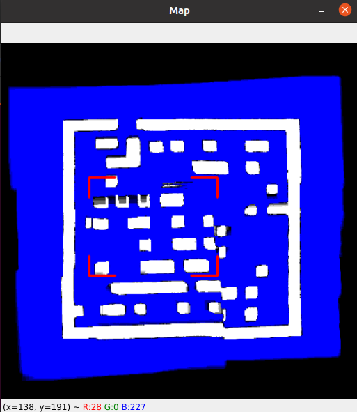

### Contributions

This project offers a number of unique design features:

- Dual robot Gazebo simulation 
- Custom image stitching algorithm for map building (scikit-learn)
- RVIZ SLAM server usage with quadcopter serving as the map server
- Separation of navigation and map building between two different robots with different perspectives, collaborating together  

---

## Installation Instructions

List of Prerequisite Software:
- PX4 (with Clover drone files)
- QGroundControl (Optional - only for physical drone)
- scikit-learn
- openpyxl (Optional - for generating mazes)
- tf2-tools (Optional - for troubleshooting)

### PX4 and COEX Clover
The Clover modules and the PX4 drone control environment can be installed in our own already created `catkin_ws` environments. 

You can follow the native build instructions here: https://clover.coex.tech/en/simulation_native.html 

At the time of writing, this page has been updated for installing on ROS Noetic in Ubuntu 20.04. Following these instructions, you will be able to build Clover and PX4 and simulate the drone, right inside of our existing workspace.

A few notes for the installation:
- I had to run `sudo apt-get upgrade` in order to update a library that I had installed through the previous instructions, though that may not be necessary anymore.
- They instruct you to clone the PX4 library to your home directory and then create some symlinks from `~/catkin_ws/src` to that directory, to have it picked up by catkin. I at first chose to clone it into `/usr/lib` as per the instructions of a previous version, but that caused some permissions problems and I eventually moved it to the home directory after some troubleshooting. If that happens:
  - The two symlinks would have to be removed and relinked when that directory moves.
  - The `~/catkin_ws/src/build` directory would have to be deleted so that catkin can remake it and link to the new directory.
- There was a permission problem copying a file to a directory that may or may not have been related to my previous blunder, but if a `configure_file Problem configuring file` error comes up, run `sudo chmod a+w ~/catkin_ws/src/PX4-Autopilot/.vscode` to fix it.
  - I also had to run `sudo chmod -R a+w ~/catkin_ws/src/sitl_gazebo`

### QGroundControl
This software allows you to interface with the physical drone and install the requisite drivers to control it using the PX4 and the offboard module in the Raspberry Pi.

You can follow the installation instructions available here:
https://docs.qgroundcontrol.com/master/en/getting_started/download_and_install.html#ubuntu

### scikit-learn
`scikit-learn` is a Python machine learning module built on `scipy` that is used in our code for the `RANSACRegressor` estimation function, as well as a few utilities. In order to install the module, simply run:
```
pip3 install scikit-learn
```
Or follow the instruction on their website here: https://scikit-learn.org/stable/install.html

### openpyxl (optional)
Python module to interface with Excel, in order to generate a random maze. Install using:
```
pip3 install openpyxl
```

### tf2-tools (optional)
The `tf2-tools` are the new recommended tools by ROS in order to view coordinate frames inside the ROS network. Only necessary for troubleshooting.

Install using:
```
sudo apt-get install ros-noetic-tf2-tools
```

### eagle_eye
Clone this repository into your `~/catkin_ws/src` folder:
```
cd `~/catkin_ws/src`
git clone https://github.com/Danealor/fall2021-project.git
```

Note that the actual ROS nodes will be located in:
- `~/catkin_ws/src/fall2021-project/code/eagle_eye`
- `~/catkin_ws/src/fall2021-project/code/world_maker`

You can make a symlink to these folders from the `~/catkin_ws/src` directory, though this shouldn’t be necessary:
```
ln -s fall2021-project/code/eagle_eye eagle_eye
ln -s fall2021-project/code/world_maker world_maker
```

Make sure to build the workspace once you’re done!
```
cd ~/catkin_ws
catkin_make
```

### Configuring the physical COEX Clover
Once the COEX Clover is built, the flight controller needs to be flashed with the correct Clover-specific firmware, which would then allow it to be controlled through the Raspberry Pi in the same manner as the simulated drone.

In general, most of the instructions are present on the [Clover website](https://clover.coex.tech). However, in order to alleviate the difficulties we’ve faced ourselves we’ve outlined the process below:
1. Follow the instructions for flashing the firmware [here](https://clover.coex.tech/en/setup.html).
	- Make sure to download the modified version of PX4 from their provided link.
	- As per the instructions [on the QGroundControl website](https://docs.qgroundcontrol.com/master/en/SetupView/Firmware.html), make sure that the flight controller is disconnected from the battery, and that it is connected to your computer by USB only after flashing is started.
	- In “Vehicle Setup->Firmware” in QGroundControl, Make sure to check “Advanced settings” on the right and select “Custom firmware file…” to choose the downloaded firmware.
2. Flash the Raspberry Pi image using the instructions available [here](https://clover.coex.tech/en/image.html).
3. Power the drone stack by battery now. The Raspberry Pi should now be booting up and already be starting an offboard drone control server, including a WiFi server and a `roscore` server.
4. Connect to the Pi through WiFi with the instructions available [here](https://clover.coex.tech/en/wifi.html). QGroundControl should now be able to connect to the drone through the WiFi connection.
5. Complete vehicle setup by tuning the sensors, following the instructions [here](https://docs.qgroundcontrol.com/master/en/SetupView/sensors_px4.html).
6. [MAKE SURE THE PROPELLERS ARE OFF!] Test motor control by following the instructions [here](https://docs.qgroundcontrol.com/master/en/SetupView/Motors.html).

---

## Running the Code

### Testing the PX4 simulated environment

*This section is optional, just to verify that the PX4 environment is installed and is functioning properly.*

To launch the basic Clover simulation world:
- `roslaunch clover_simulation simulation.launch`
- Check `rqt_graph` to see the node graph

To get current position:
- `rostopic echo -n 1 /mavros/local_position/pose`

To test simple flight: *(skip if you didn't install QGroundControl)*
- Open QGroundControl from the desktop.
- Confirm parameters as they are.
- Check that "Ready To Fly" appears in the top left, and click Takeoff.
  - Slide to confirm at the bottom.
  - Keep an eye on Gazebo; the simulated drone should start up its rotors and then slowly rise up.
- Click Land to touch back town.
  - Slide to confirm again.

**Programming:** The `simple_offboard` node is a high-level navigation and telemetry node that simplifies all the programming into a few easy-to-use services.
- Check that it exists:
  - `rosnode info simple_offboard`
  - Note all the topics it publishes and subscribes to in `/mavros`
  - The important part is under "Services:", which lists all our callable functions for this node. See reference and usage [here](https://clover.coex.tech/en/simple_offboard.html).
- Check out the navigation service:
  - `rosservice type /navigate | rossrv show`
- Takeoff to 1.5m at 0.5m/s (keep an eye on Gazebo)
  - `rosservice call /navigate 0.0 0.0 1.5 0.0 0.0 0.5 body true`
  - "body" means relative coordinates
- Fly to (2m,2m) at 1.0m/s
  - `rosservice call /navigate 2.0 2.0 1.5 0.0 0.0 1.0 map true`
  - "map" means global coordinates
- Land
  - `rosservice call /land`

### Generating a maze

*This section is also optional, as a pre-generated maze has already been created in the cloned directory. You should still, however, execute step 5 to test that this world loads properly.*

1) CD to the world_maker scripts folder (`cd ~/catkin_ws/src/fall2021-project/code/world_maker/scripts`)

2) OPTIONAL: 

    Make a copy of the world files first by running the following terminal commands:

- `cp custom_world_coords.xls custom_world_coords_BACKUP.xlsx`
- `cp custom_world_coords.csv custom_world_coords_BACKUP.csv`

  If you would like to randomize the maze after that, run `python3 randomizer.py`

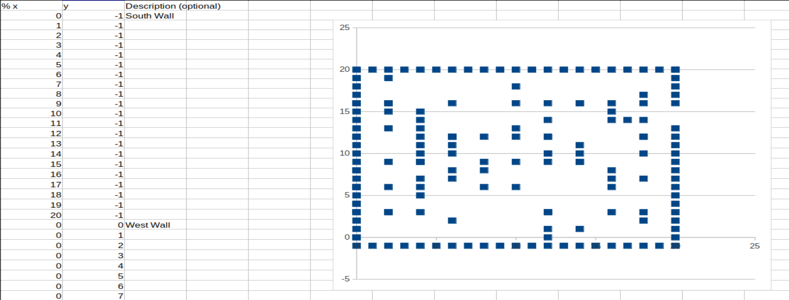

3) Save the most up to date `custom_world_coords.xlsx` as a text CSV file (`custom_world_coords.csv`).

4) Run the following command to generate the world:
```
./create.py custom_world_coords.csv ../../eagle_eye/resources/worlds/bounded_maze.world -r 0.5 -H 0.25 -b ../../eagle_eye/resources/worlds/bounded.world
``` 
What this does is utilize the saved CSV file to create a matching .world file in the `eagle_eye` repository with a resolution of 0.5 meters, height of 0.25 meters, and builds upon the `bounded.world` world file that places a red boundary square around your newly formed maze.

5) Launch the Gazebo world associated with the world_maker package (`roslaunch eagle_eye maze_world.launch`).

6) Provided there were no errors, the Gazebo world should spawn blocks of a certain color to match the coordinates provided in the `custom_world.coords.xlsx`. THIS IS NOT THE FINAL WORLD BUILD, THE PURPOSE OF THIS IS TO VERIFY A TURTLEBOT SPAWNS WITH THE MAZE YOU DESIGNED.

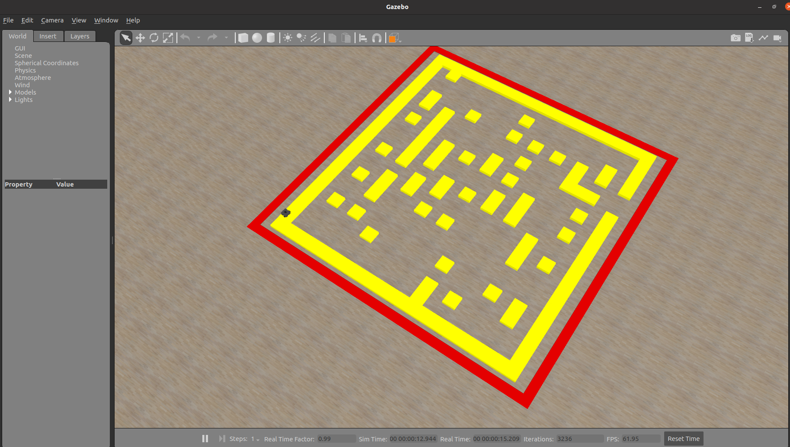

7) OPTIONAL: To change the color of the blocks, open the `create_world.py` script and update line 157 with a color name (Ex: Gray).

8) After successful maze and turtlebot generation, please continue to the next section.

### Running the Eagle Eye Simulation

**Launching the world:**

To launch both the maze world along with both the drone and turtlebot and their respective environments, run the following command in a terminal:
```
roslaunch eagle_eye eagle_eye.launch
```

The following modules will be launched, which can be checked with `rosnode list`:
- Gazebo
- The simulated COEX Clover drone through MAVROS
- The turtlebot
- The SLAM server (AMCL and move_base)
- RViz

A few arguments to note for this launch file are:
- **`gui`:** set to `false` in order to run headless
- **`spawn_turtle`:** set to `false` in order to omit the turtlebot and SLAM server
- **`model`:** set to `burger`, `waffle` or `waffle_pi` to select turtlebot model
- **`nav_server`:** set to `false` to omit launching the SLAM server
- **`open_rviz`:** set to `false` to not launch RViz
- **`x_drone` and `y_drone`:** Adjust to set starting position of drone
- **`x_turtle` and `y_turtle`:** Adjust to set starting position of turtlebot

Check Gazebo that you can see the yellow maze within the red bounding box, as well as a turtlebot and drone sitting safely on the ground.

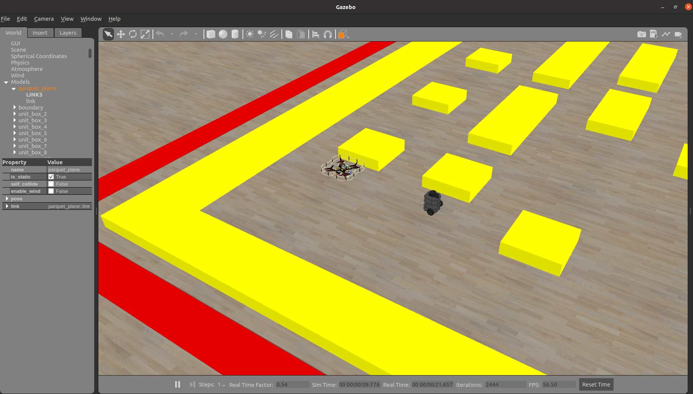

**Running the drone mission:**

In order to send the drone off on its merry way, simply run:
```
rosrun eagle_eye drone_control.py
```

A couple arguments can be specified for this node:
- **`~control`:** Set to `false` to prevent any flight control commands from being executed. Useful for testing mapping while sending flight commands using `rosservice call /navigate` commands in the terminal. [Default: `true`]
  - **Example:** `rosrun eagle_eye drone_control.py _control:=false`
- **`~mode`:** Set to `aligned_dir` or `search_nearby` to specify specific stitching mode to use. [Default: `auto`]

The `drone_control` node is programmed as a state machine will autonomously advance through the following states/phases during its mission to map the maze:
1. **`take_off`:** Start up the drone and take off at 0.5m/s to a height of 1.5m.
2. **`taking_off`:** Wait until the drone is stable at 1.5m high.

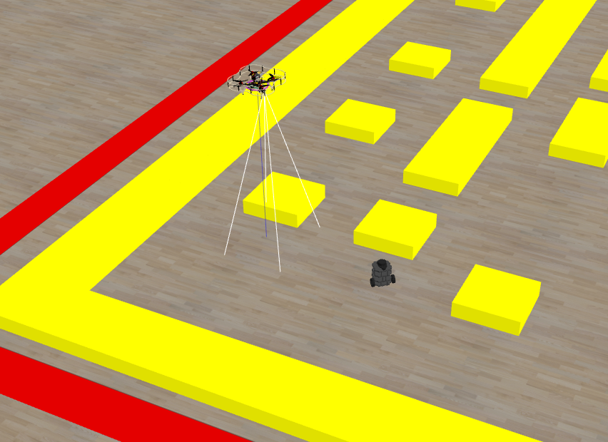

3. **`find_edge`:** Here is where the bulk of the work happens, and where several OpenCV image windows will pop open. In short: 
   1. The drone will attempt to find the red boundary on the ground and proceed to follow it clockwise at 0.25m/s.
   2. The drone will stitch together imagery from beneath it to build up a world view of both the maze and the boundary its following, using the movement of the maze as well as the straight edge of the boundary as a guide for self-positioning.
   3. Once the drone has completed the boundary into a closed path, which could take one or two passes, the drone will take a snapshot of the finished boundary and mask off all locations outside of it, then proceed to the next state/phase.

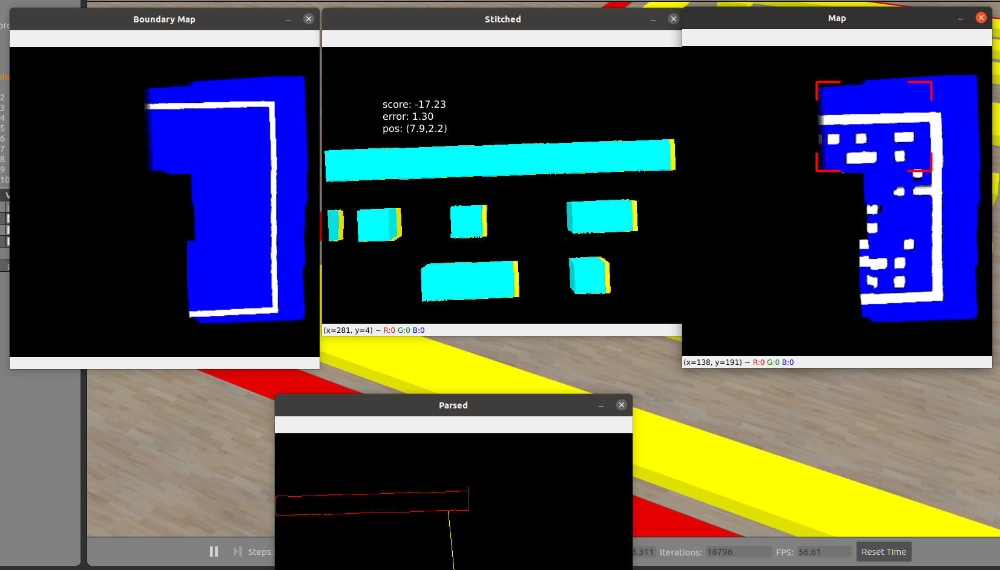

4. **`fill_map`:** The drone will continue mapping out the maze below it in a similar fashion, but this time fly towards unvisited locations inside the maze, going for the nearest locations first. Once everything inside the boundary has been mapped out, the drone advances to its final state.

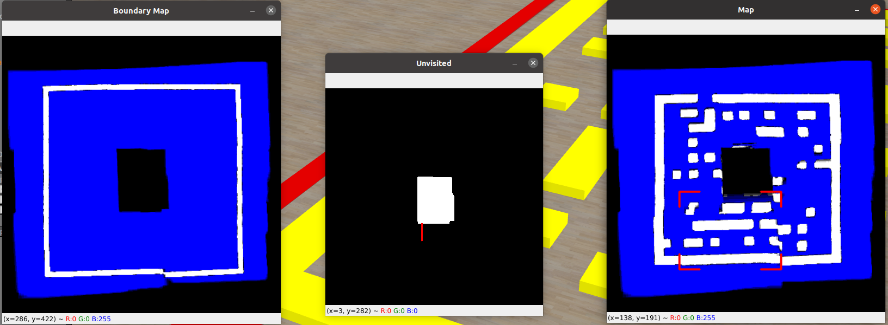

5. **`going_home`:** The drone flies to a corner of the boundary and lands. Flight and mapping will cease, but will stay running to allow the map to be captured on the `~/turtle/map` topic (see below for saving the map).

The terminal will be outputting the drone's current state, as well as some debug information from the image stitching algorithms.

The functions for the OpenCV imagery windows are described by the window title as follows:
- **`Below`:** The image from the camera, warped using a homography transformation to represent physical space on the ground plane (100px = 1m). Currently not actually shown in a window unless no boundary is found.

- **`Stitched`:** The result of the image stitching algorithm, depicted using the yellow wall remembered from the last good frame overlayed by the walls from the current frame, which are light blue if valid or purple if invalid. Some statistics are printed as well, with `score` representing goodness of fit (higher is better) and `error` representing distance from estimated flow (lower is better). `pos` shows the current estimated position.

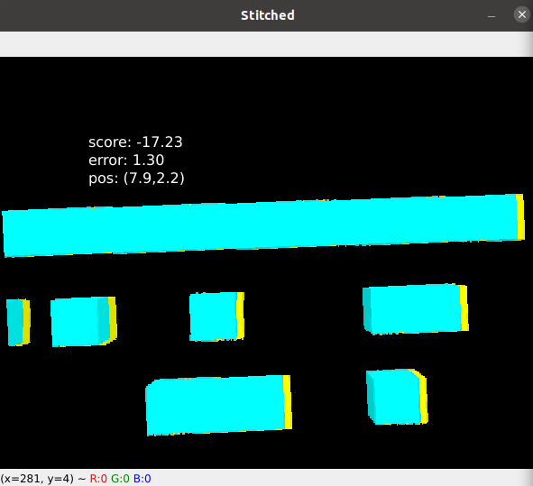

- **`Map`:** The result of the many frames taken by the drone stitched together. White represents a wall, blue represents open space, and black represents unknown. It takes a few frames to solidify a known wall or open space, or to change this marking back to unkown.

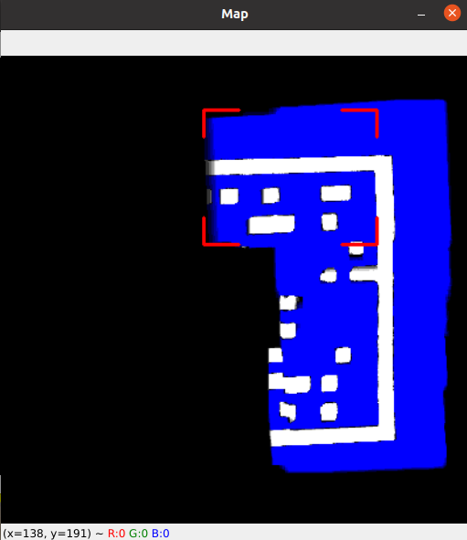

- **`Boundary Map`:** Same as `Map`, except for the red boundary on the ground. The `find_edge` state will finish once this boundary is closed.

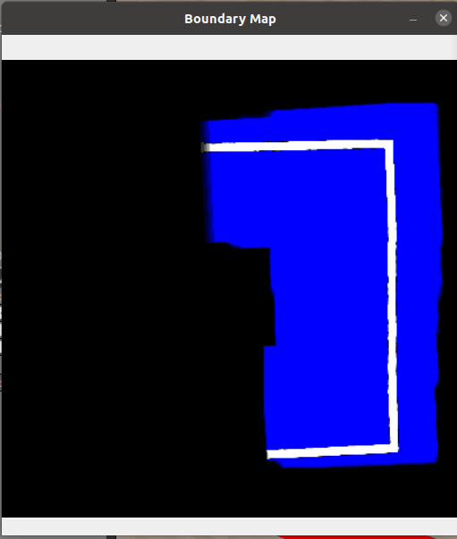

- **`Rotated`:** Might be shown when the drone switches to the `aligned_dir` backup stitching mode (or when it is specified in the arguments). Shows the `Below` image rotated to align with direction of travel (on the x-axis).

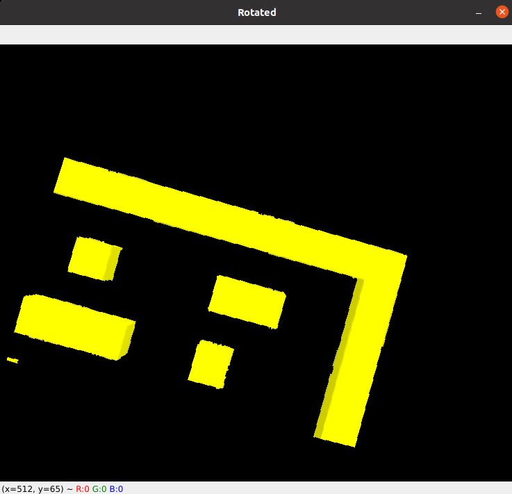

- **`Parsed`:** The edges of the red boundary, parsed separately using a Canny filter. Specific to the `find_edge` state, used to follow the edge. The yellow line points towards the edge, the green line points towards the intended direction of travel.

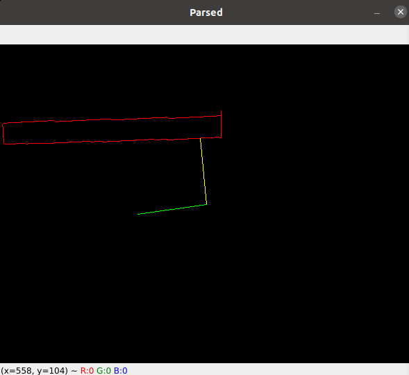

- **`Unvisited`:** Shown during the `fill_map` state, shows which areas of the map are yet unvisited. A red line points towards the nearest point the drone will travel to.

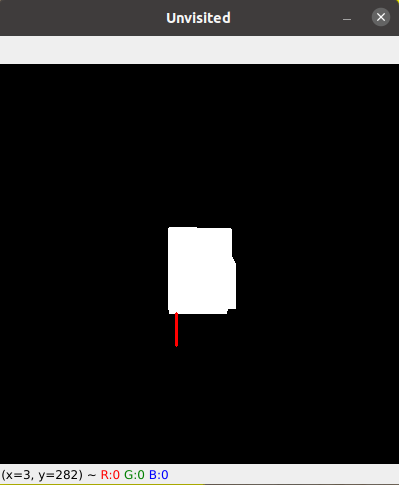

- **`Map View`:** Currently will not be shown, since stitching from the map is disabled in code (see Future Work for more information). Represents a nearby portion of the map found to use for stitching.

**Moving the turtlebot:**

The map will be updated in realtime in RViz. However, since the SLAM server resets the turtlebot position every time the map is updated, it is currently recommended to **wait until the drone mission is finished** before testing turtlebot navigation.

Once the map has been completed:
1. Set the turtlebot position in the map using the green arrow tool.
	- (Finding the turtlebot with the drone is an unimplemented feature)
2. Give the turtlebot a navigation command with the red arrow tool.
3. Wait for the turtlebot to localize itself and navigate around the obstacles found by the drone to reach its destination.
	- This may take some time, due to error in translation of the map between reference frames and uncertainty in the turtlebot readings.

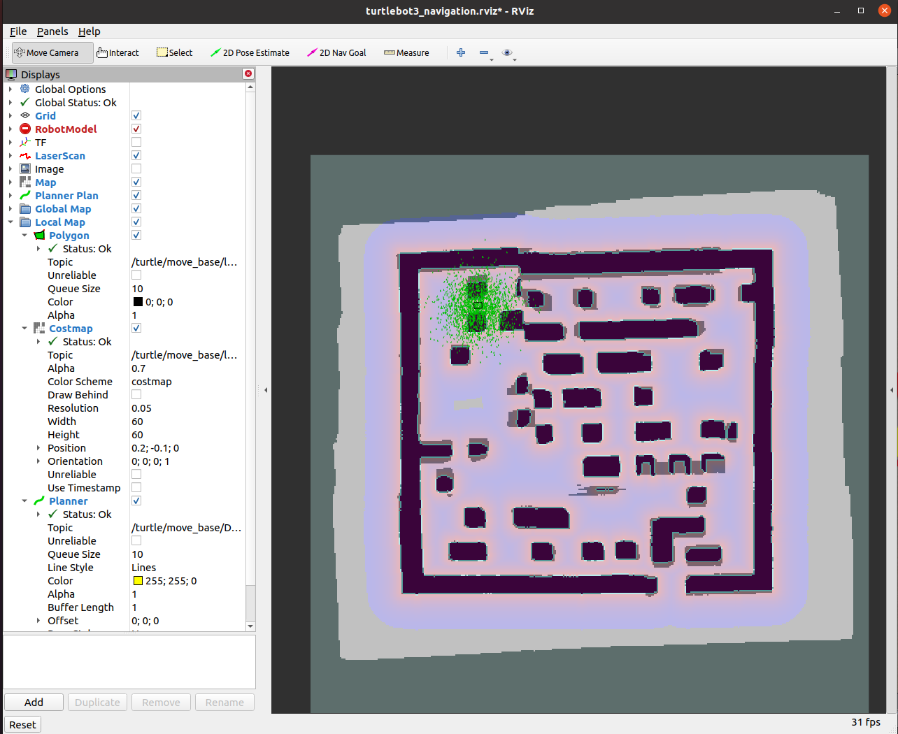

**Saving the map:**

Since we may not want to fly the drone mission every time, we can save the map with the following command:
```
rosrun map_server map_saver -f ~/Documents/eagle_eye/map map:=/turtle/map
```

The map could then be published again in a future session with the following command:
```
rosrun map_server map_server ~/Documents/eagle_eye/map.yaml _frame_id:=/turtle/map
```

### Test the physical drone

While we have not tested the autonomous drone control loop on a physical drone, we did manage to establish remote connection to give commands over the network through the Raspberry Pi and receive telemetry.

To accomplish the same:
1. Connect to the drone's WiFi (follow instructions [here](https://clover.coex.tech/en/wifi.html)).
2. Open http://192.168.11.1:8080/ to view telemetry, or follow instructions [here](https://clover.coex.tech/en/web_video_server.html).
3. Run the following command to set the Pi's `roscore` as the main server:
```
ROS_MASTER_URI=http://192.168.11.1:11311
```
4. **WITH THE PROPELLERS REMOVED** execute the following command to command the drone to take off:
```
rosservice call /navigate 0.0 0.0 1.0 0.0 0.0 0.5 body true
```
5. Execute the following command to spin down the rotors:
```
rosservice call /land
```

---

## Description of Operation

As described in the "Running the drone mission" section, the `drone_control.py` node is implemented as a state machine, advancing through its states like phases in its mission. While the states themselves have been described in that section, here we will outline the general pipeline an image taken from the drone camera takes within each stage.

1. The image is captured from the `/main_camera/image_raw` topic, along with current telemetry for the drone's position, rotation and velocity.
	- This information is saved until the next cycle in the main loop.
2. Within the main loop, the image is undistorted from any lens effects using a "plumb-bob model" described in the `/main_camera/camera_info` metadata topic.
3. The image is projected from the camera to the ground plane using a homography transformation generated from the drone's position and rotation. This image is then recentered to create the `Below` image, where each pixel represents 1cm and the center of the image represents the position directly below the drone, regardless of where the drone is pointing.
4. The image is filtered for yellow walls and red boundaries using a probabilistic model (p-value on preprogrammed distributions) on an HSV version of the image.
5. Stitching data is initialized for the image, where for each row and each column, a list is created for the positions of the positive and negative edges of the walls.
6. An initial estimate for the drone translation (flow) since the last image is found using the translation telemetry acquired with each image. This is used to create an initial guess for the amount the image has shifted since the last good image taken.
7. The new image is matched with the last image, either by alternating between matching rows and columns iteratively starting with the guess position (`stitch_mode='search_nearby'`) or by rotating the image and finding the translation only in the direction of movement implied by the estimated flow (`stitch_mode='aligned_dir'`, used when the flow is large enough).
8. This match is used to update a running tally of the offset from the "real" position to the position given by the drone's translation telemetry, which drifts over time since it is based on its own optical flow algorithm.
9. The resulting image and position is then overlayed onto the map in the correct location, adding some certainty to each pixel as to whether it is a wall or free space.
10. The image and position is saved to be used as the reference for the next frame, allowing the drone to iteratively track its movement based on the position of the maze below while simultaneously stitching together the map (our own sort of SLAM, in a way!)

---

## Measures of Success

<TABLE>
<TR>
    <TH>Measure of Success</TH>
    <TH>Status (completion percentage)</TH>
</TR>
<TR>
    <TD>View both robot models in Gazebo</TD>
    <TD>100%</TD>
</TR>
<TR>
    <TD>Demonstrate that the quadcopter stays in close proximity to the maze</TD>
    <TD>100%</TD>
</TR>
<TR>
<TD>Demonstrate that the quadcopter completes passes of the maze to develop an image</TD>
    <TD>100%</TD>
</TR>
<TR>
<TD>Demonstrate that the rover receives information from the quadcopter and moves</TD>
    <TD>100%</TD>
</TR>
<TR>
<TD>Demonstrate that the rover can successfully complete a maze</TD>
    <TD>90% (SLAM server sometimes times out despite a valid solution path available)</TD>
</TR>
<TR>
<TD>Implement code on a real COEX quadcopter</TD>
    <TD>50% (Code requires a physical maze made of yellow walls and a red border in order to perform as expected, as well as adjusting the stitching algorithm to work with real-life messy pictures)</TD>
<TR>

</TABLE>

## What did you learn from this project?

### Learned
- Overall better understanding of ROS Topics and Services
- Map generation via Excel and CSV file use
- Use of groups in `.launch` files to differentiate between robots
- Modifying `.world` files to create custom worlds
- Frame generation using tf2_tools from wiki.ros.org/tf2_tools for troubleshooting purposes, as well as how to manage and reassign coordinate frames themselves
- How to use a variety of image processing tools, including: Camera Calibration, Homography, Image Stitching, Filtering and Masking
- How to collaborate and coordinate between different parts of a system, both with inter-robot communication and as partners working on different aspects of the project

### Challenges
- Image processing is far more laborious than initially expected - so much data to sift through and so volatile to the slightest of changes!
- A multitide of coordinate transformations to confuse the soul, from xy-coordinates (+x,+y) to matrix indices (-y,+x) to cv2 positions (+x,-y) to all the different transformations from the camera reference frame to the ground reference frame
- The images acquired by the drone in simulation are too "simple" to be used in traditional image stitching algorithms; there are not enough unique features to use as keypoints, thus we had to create our own custom stitching algorithm based on the walls of the maze.
  - We imagine we would have far different problems when translating to a physical realization of this project.
- When doing localization using image stitching on the last image seen, the given position is very sensitive to slight errors in each frame and will drift over time, just like the drone's own telemetry. Our own band-aid for this problem was to use the boundaries as calibration for our coordinates, but another solution is hypothesized in "Future Work".

---

## Future Work

There are a number of ways to build upon the work we’ve done so far. A few ideas we would have liked to try, but did not have the time for are as follows:

- Adding a second turtlebot to “seek” the initial turtlebot which would would both utilize the map generated by the quadcopter, but for different purposes
- Adding additional code for the quadcopter to be able to locate the turtlebot and provide better maze solving instructions 
  - This should only require filtering for a different color (dark gray), or at most running a pattern-matching module, and then publishing the position to the `/turtle/initialpose` topic.
- Implementing a more complex and robust image stitching algorithm that does not require a boundary or walls to be of a certain color
- Create a more robust navigation server than RVIZ SLAM to increase speed and efficiency of the turtlebot’s solution path
- Execute image stitching based on the known map instead of the last frame
  - This should result in a much more stable self-positioning since our position estimate is not tied to the floating position of the last frame, but rather the static "known-good" position of the map itself.
  - **NOTE:** This is already implemented in the code, but has been disabled because our current stitching algorithms are not capable of matching imagery to the rather "messy" map output. You can test this by uncommenting line 1030 in `code/eagle_eye/scripts/drone_control.py` and waiting for the border to close.
- Allow for the disabling of preview imagery, which is likely significantly slowing down the computation loop (or perhaps only show it occasionaly, on a separate timer).
  - This, along with running headless, could allow the drone to scan the maze faster.
- Run on the physical drone!
  - This might require a more robust image stitching algorithm, which could be either more difficult or easier depending on how easy it would be to find matching keypoints in real images.
- Launch a web server in parallel in order to preview output imagery in a more organized fashion.

---

## References/Resources

- Programming Robots with ROS by Morgan Quigley, Brian Gerkey, and William D. Smart
    - Ch 9&10: SLAM Server - We made heavy use of the in-built turtlebot navigation server in order to locomote our turtlebot, as well as understanding the map that it has built so that we can build our own on-the-fly (literally!).
    - Ch2: roslaunch: We used the book’s resources as well as the online ROS documentation and forums in order to modify our `.world` and `.launch` files
        - https://answers.ros.org/question/295383/controlling-multiple-drones-using-ros/ for using named groups in our `.launch` file
    - Existing turtlebot code such as `multi_turtlebot3.launch` used as reference for writing our own configuration files
- OpenCV2 documentation for Image Stitching and Computer Vision (camera calibration):
  - https://docs.opencv.org/4.x/d1/d46/group__stitching.html
  - https://docs.opencv.org/4.x/d9/d0c/group__calib3d.html
- COEX Clover installation and simulation documentation
  - https://clover.coex.tech/en/


